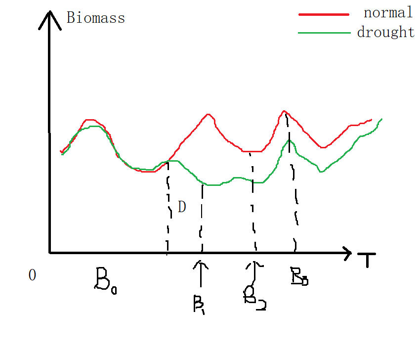

# Ecology Letters - 2017 - Kreyling - Species richness effects on grassland recovery from drought depend on community

## Abstract

- multisite & drought manuplination experiments 
- drought resistence & recovery 

- reduction (30% here in the experiment) of biomass production

- Recovery only affected by the species richness

- Could be linked to asynchrony of species responses (Resistence difference?)
  
## Introduction

- two facets of stablity: resistence and recovery
- diversity -- resistence (different conclusions)
- resistence: instantaneous impact of exogenous disturbance on a system (对外界瞬时扰动的抗性)
- recovery: the endogenous processes that pull the disturbed system back towards an equilibrium(系统返回常态的时间)

## Experiment Settings

- No importance

## metrics

- resistence
  $Res = \frac{B_{1,drought}}{B_{1}}$
  0（no resistence) --------- 1(full resistence)
- recovery
  $Rec = \frac{B_{3,drought}}{B_{3}}$

  0 --- weak recover ------1(full recover) ------- overcompensation

In which $B_{0}$ is the biomass before the experiment,
$B_{1}$ is the biomass right after the drought,
$B_{2}$ is the biomass at the end of this season,
$B_{3}$ is the peak biomass 

## Results

- More species, better recovery (resistence seems not largely changed)
- 不放图了反正paper里看得到

## Discussion

- Need more species in further experiments(但是跟我们就没有关系了)

# 总结

能用到的包括生物量，实验的设置及分析，对环境抵抗和恢复力的measure

 
